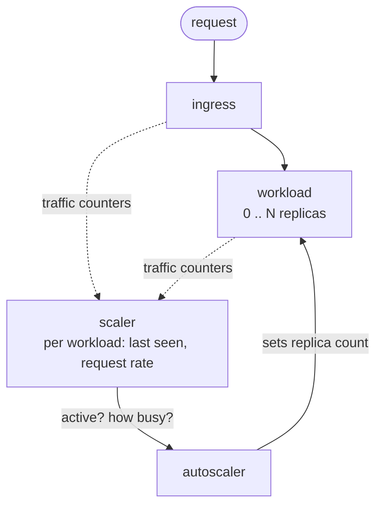
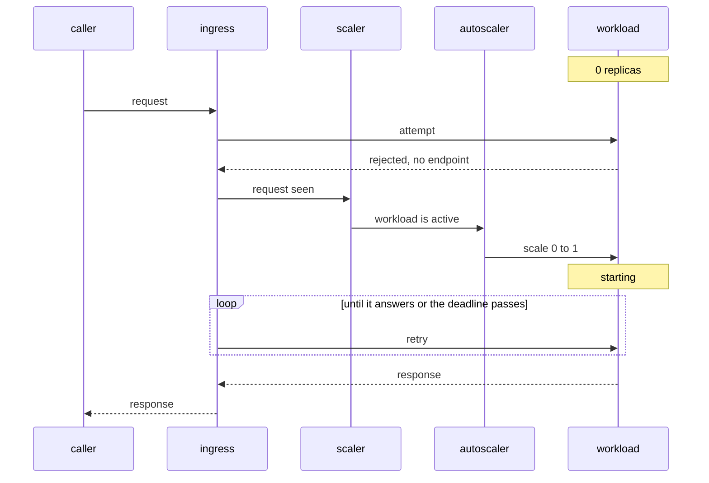

# scale-to-0 (WIP)

## How it works





## Running it

```bash
make up      # create the cluster and install everything
make down    # delete the cluster
make help    # every target
make test    # Go tests
```
